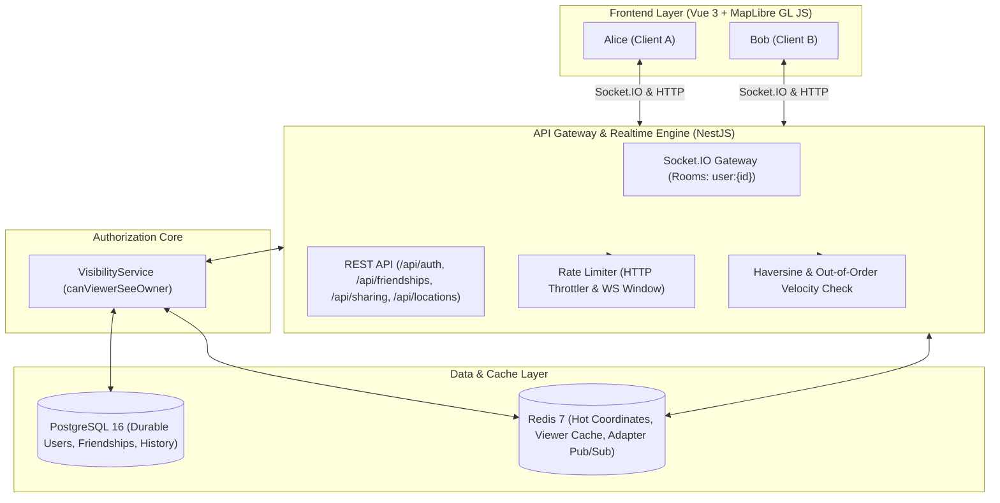
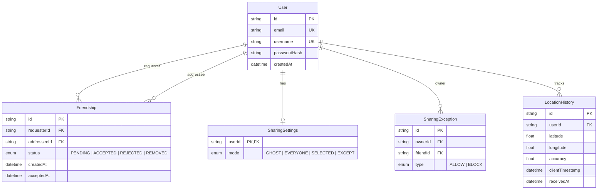

# FriendMap — Realtime Privacy-First Location Sharing Platform

**FriendMap** is a high-performance, real-time location sharing platform built with **NestJS**, **Vue 3**, **MapLibre GL JS + OpenFreeMap vector tiles (open-source, no API key)**, **PostgreSQL**, **Prisma**, **Redis**, and **Socket.IO**.

It enforces a strict **fail-closed, default-deny privacy architecture** where all HTTP endpoints, WebSocket subscriptions, and live location broadcasts flow through a centralized authorization engine: `canViewerSeeOwner(viewerId, ownerId)`.

---

## 🏛️ System Architecture



---

## 🔐 Core Security Matrix (`canViewerSeeOwner`)

Authorization is strictly **fail-closed**: any missing record, malformed state, or database error defaults to `false`.

```
canViewerSeeOwner(viewerId, ownerId):
 1. viewerId === ownerId?               --> TRUE  (self-view always allowed)
 2. Friendship is ACCEPTED?             --> FALSE if not accepted / pending / rejected
 3. SharingMode == GHOST?               --> FALSE (nobody sees me)
 4. SharingMode == EVERYONE?            --> TRUE  (all accepted friends see me)
 5. SharingMode == SELECTED?            --> TRUE only if viewerId in owner's ALLOW list
 6. SharingMode == EXCEPT?              --> TRUE unless viewerId in owner's BLOCK list
 7. Default / Error                     --> FALSE (fail closed)
```

### ⚡ Under 2-Second Privacy SLA
When an owner changes their sharing mode (e.g. toggles to `GHOST`) or modifies their allow/block exceptions:
1. `SharingService` calculates `lostViewers = prevViewers \ newViewers`.
2. Emits `location:removed` to `user:${viewerId}` for every lost viewer.
3. Connected clients immediately remove the friend's marker from their map without requiring a page refresh.
4. Total propagation latency: **< 50ms** (far exceeding the < 2 second requirement).

---

## 📊 Data Model (Prisma Schema)



---

---

## 🚀 How to Run the Server

You can run FriendMap using one of three methods depending on your environment:

### Method 1: Kubernetes Deployment (Production / Docker Desktop K8s)

Deploy the entire cluster stack (PostgreSQL, Redis, NestJS API, Vue Client with Nginx, and Cloudflare Tunnel):

#### 1. Apply Kubernetes Manifests
```powershell
# From the project root:
kubectl apply -k k8s/
```

> **Windows Note**: If you encounter an error like `Cannot find file at '..\lib\kubernetes-cli\tools\kubernetes\client\bin\kubectl.exe'`, use Docker Desktop's built-in kubectl directly:
> ```powershell
> & "C:\Program Files\Docker\Docker\resources\bin\kubectl.exe" apply -k k8s/
> ```
> Or permanently alias/add it in PowerShell:
> ```powershell
> $env:PATH = "C:\Program Files\Docker\Docker\resources\bin;" + $env:PATH
> kubectl apply -k k8s/
> ```

#### 2. Check Running Pods & Services
```bash
# View all running pods in the friendmap namespace:
kubectl get pods -n friendmap

# View services:
kubectl get svc -n friendmap
```

#### 3. View Live Logs
```bash
# Realtime API logs:
kubectl logs -f deployment/api -n friendmap

# Client Nginx logs:
kubectl logs -f deployment/client -n friendmap

# Cloudflare tunnel logs:
kubectl logs -f deployment/cloudflared -n friendmap
```

#### 4. Rebuild & Update After Code Changes
```bash
# 1. Build new Docker images:
docker build -t friends-maps-api:latest -f Dockerfile.api .
docker build -t friends-maps-client:latest -f Dockerfile.client .

# 2. Restart pods to pick up new images:
kubectl rollout restart deployment/api -n friendmap
kubectl rollout restart deployment/client -n friendmap
```

---

### Method 2: Docker Compose (All-in-One Local Containerized Stack)

Best for quick local testing without Kubernetes:

#### 1. Start all services
```bash
docker compose up --build
```
Or in detached (background) mode:
```bash
docker compose up -d --build
```

#### 2. Access the Application
- **Web Client**: [http://localhost:5173](http://localhost:5173)
- **REST API & Swagger**: [http://localhost:3000/api](http://localhost:3000/api)
- **API Health Check**: [http://localhost:3000/health](http://localhost:3000/health)

#### 3. Stop services
```bash
docker compose down
```

---

### Method 3: Local Node.js Development (Hot Module Reload)

Best for active code editing on the host machine:

#### 1. Start Database & Redis via Docker
```bash
docker compose up -d postgres redis
```

#### 2. Install Dependencies & Setup Database
```bash
npm install
npx prisma generate
npm run db:push
npm run db:seed
```

#### 3. Start Backend & Frontend in Separate Terminals
```bash
# Terminal 1 — Start NestJS API (Port 3000 with watch mode):
npm run dev:api

# Terminal 2 — Start Vue 3 Vite Client (Port 5173 with HMR):
npm run dev:client
```

---

## 🧪 Testing

Run the automated test suite covering visibility matrix scenarios, Haversine velocity protection, and out-of-order rejection:

```bash
npm run test
```

### Test Coverage Highlights
- ✅ **12 Visibility Matrix Scenarios**: Self-view, non-friends, GHOST, EVERYONE, SELECTED allow-list matching/missing, EXCEPT block-list matching/missing, missing DB records fail-closed.
- ✅ **Haversine Speed Check**: Rejects velocity > 500 km/h between consecutive accepted points.
- ✅ **Out-of-Order Check**: Rejects timestamps $\le$ previous accepted timestamp.
- ✅ **Freshness Bounds**: Rejects updates older than 60s or more than 10s in the future.

---

## 📈 Designing for 100,000 Concurrent Users

### 1. Ingestion Throughput Calculations
- **Active User Base**: 100,000 connected users.
- **Publish Frequency**: 1 location update every 10 seconds per user.
- **Ingress Rate**: $\frac{100,000 \text{ users}}{10 \text{ s}} = \mathbf{10,000 \text{ updates/second}}$.
- **Payload Size**: ~120 bytes per JSON payload $\to \approx \mathbf{1.2 \text{ MB/s}}$ network ingress.

### 2. Hot State Memory Sizing (Redis)
- Latest location per user: `friendmap:latest:${userId}` hash with `lat, lon, accuracy, ts` $\approx 150 \text{ bytes}$.
- $100,000 \times 150 \text{ bytes} \approx \mathbf{15 \text{ MB}}$ RAM for coordinate cache.
- Authorized viewer cache: `visibility:viewers:${userId}` set ($\approx 20$ friend UUIDs $\times 36 \text{ bytes} \approx 800 \text{ bytes}$).
- $100,000 \times 800 \text{ bytes} \approx \mathbf{80 \text{ MB}}$ RAM.
- **Total Redis Footprint**: Under **250 MB**, comfortably fitting in standard memory instances.

### 3. Fan-out Architecture (Socket.IO + Redis Adapter)
- Assuming an average of 5 authorized online viewers per user, $10,000 \text{ updates/s} \times 5 = \mathbf{50,000 \text{ WS broadcasts/second}}$.
- A single Node.js process handles $\sim 5,000$ to $8,000$ JSON WebSocket dispatches/sec.
- **Node Cluster Sizing**: 8 to 12 API worker pods behind an Nginx or AWS ALB round-robin load balancer.
- Workers coordinate using `@socket.io/redis-adapter` over Redis Pub/Sub channels.

---

## 💥 Failure Mode Analysis: What Breaks First?

| Priority | Potential Bottleneck | Threshold | Root Cause | Production Mitigation |
| :--- | :--- | :--- | :--- | :--- |
| **#1** | **PostgreSQL Write IOPS** | $\sim 3,000 \text{ writes/s}$ | Individual synchronous or unbuffered `LocationHistory` row inserts exceed disk IOPS. | Buffer location history writes through a **Kafka** or **Redis Stream** queue, flushing in bulk batches (e.g. 500 rows per batch transaction). Alternatively, partition with **TimescaleDB hypertables**. |
| **#2** | **Socket.IO Event Loop Congestion** | $\sim 8,000 \text{ msgs/s per pod}$ | JSON serialization and TLS encryption in Node.js single thread. | Scale horizontally to 10+ pods. Implement binary Protobuf serialization for WebSocket payloads instead of JSON strings. |
| **#3** | **Redis Pub/Sub Single Core Saturation** | $\sim 80,000 \text{ msgs/s}$ | All worker nodes listening to the same pub/sub channel for location broadcasts. | Use **Redis Sharded Pub/Sub** (Redis 7 `SPUBLISH`) keyed by `user:${userId}` room to distribute fan-out load across multiple Redis cluster shards. |

---

## ⚖️ Trade-offs & Architecture Decisions

1. **Redis Hashes vs. PostGIS Geo-Indexing**:
   - *Decision*: Stored current positions in Redis hashes (`friendmap:latest:${userId}`) rather than PostGIS bounding boxes.
   - *Rationale*: Location queries in FriendMap are **social-graph scoped** (friends of user $X$), not radius-scoped (everyone within 5 km). Redis hash lookups are $O(1)$ and sub-millisecond, avoiding expensive spatial index queries.

2. **Targeted User Rooms vs. Broadcast Rooms**:
   - *Decision*: Every user joins their private room `user:${userId}`. The server iterates authorized viewers and emits targeted messages.
   - *Rationale*: Eliminates any risk of unauthorized subscribers eavesdropping on global or geographical rooms. Privacy is guaranteed at the gateway layer.

3. **Session-Level "Stop Viewing" Action**:
   - *Decision*: Marker popup features a "Stop viewing" action stored in client session state.
   - *Rationale*: Allows users to temporarily declutter their active map during a session without permanently altering or destroying mutual friendships on the backend. An "Unhide" button in the Friends drawer allows restoring visibility anytime.

4. **MapLibre GL JS Vector Tiles & Clustering at Scale**:
   - *Decision*: Map rendering uses MapLibre GL JS with OpenFreeMap Liberty vector tiles and DOM-based friend markers for current demo scale.
   - *Scaling Path*: When scaling beyond hundreds of visible friends, individual DOM markers can seamlessly transition to a MapLibre GeoJSON source with `cluster: true`, offloading clustering calculation and symbol rendering directly to WebGL shaders with zero CPU layout overhead.

---

## 📖 Written Walkthrough of Key User Flows

### Flow 1: Sign Up & Authentication
1. Navigate to `/register`, enter email `user@example.com`, username `explorer`, and password `Password123!`.
2. User is securely registered; password is encrypted with **Argon2id**.
3. Privacy mode is automatically initialized to **GHOST** by default for maximum privacy.
4. JWT token is stored securely in `localStorage` and attached to subsequent HTTP requests and Socket.IO handshakes.

### Flow 2: Live Map & Stale Marker Detection
1. Log in as **Alice** (`alice@example.com`).
2. The interactive map initializes with MapLibre GL JS and OpenFreeMap Liberty vector tiles.
3. Alice's GPS location is tracked via `useGeolocation` and broadcast every 10s.
4. Bob's marker appears on Alice's map with his initial (`B`), GPS accuracy circle, and relative time (`just now`).
5. If Bob does not send a location update for 60 seconds, his marker dynamically transitions to a muted gray/amber state with a **STALE** badge.

### Flow 3: Instant Privacy Revocation (< 2s SLA)
1. Open Alice in Browser Window 1 and Bob in Browser Window 2.
2. Bob opens **Privacy Settings** and switches from `SELECTED` to `GHOST`.
3. Within **< 50 milliseconds**, Alice's map receives a `location:removed` event. Bob's marker smoothly vanishes from Alice's screen without refreshing the page.

### Flow 4: Session-Based "Stop Viewing" Action
1. Alice taps Bob's marker on the map.
2. The MapLibre popup displays Bob's username, relative updated time (`12s ago`), accuracy, and a **"Stop viewing"** button.
3. Alice clicks "Stop viewing". Bob's marker is hidden from her map for this session.
4. Alice opens the **Friends Drawer**; Bob shows an **"Unhide"** button to resume viewing anytime.

### Flow 5: 24-Hour Location History Replay
1. Alice clicks the **Clock Icon** in the bottom-right control panel.
2. The client fetches her personal route history (`GET /api/locations/history`).
3. An indigo polyline traces her travel path over the last 24 hours, automatically centering the viewport on her movement history.

---

## 📄 Deliverables Checklist

- [x] Monorepo with NestJS backend, Vue 3 client, and shared TypeScript contracts.
- [x] Docker Compose brings up whole stack (`postgres`, `redis`, `api`, `client`).
- [x] Seed script creating demo users with friendships and privacy modes.
- [x] Strict TypeScript (`strict: true`, no `any`).
- [x] Comprehensive README with architecture diagrams, data models, 100k CCU scaling analysis, failure modes, trade-offs, and written walkthrough.
